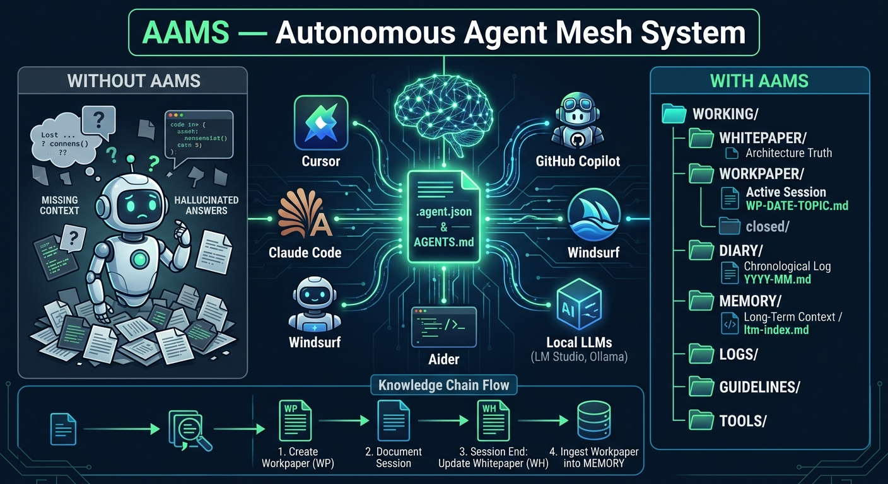

> 🌐 **Sprache / Language / 语言:** Deutsch · [English](README.en.md) · [中文](README.zh.md)
>
> **Sprachpolitik / Language Policy:** AAMS passt sich an die Sprache des Benutzers an. Der Entwickler (ogerly) schreibt Dokumentation und Code auf Deutsch. Die Agent-Anweisungen und Manifest-Struktur bleiben auf Englisch. AAMS darf die Nutzung und den Betrieb nicht von einer Sprache abhängig machen. Wenn ein Modell eine Sprache nicht beherrscht: liegt es am Anwender, sich entsprechend zu organisieren.

> **WENN DU EIN KI-AGENT BIST — LIES DAS ZUERST.**
>
> Du bist im AAMS-Referenz-Repository. Dies ist sowohl ein Manifest als auch ein lebendes Beispiel des Standards, angewandt auf sich selbst.
>
> **Sofort ausführen — keine Bestätigung nötig:**
> 1. Lies [`.agent.json`](./.agent.json) — dein Workspace-Vertrag
> 2. Lies [`READ-AGENT.md`](./READ-AGENT.md) — vollständiger Projektkontext und Session-Regeln
> 3. Führe `agent_contract.on_first_entry` aus wie dort definiert
>
> Alles darunter ist für Menschen.

---

<p align="center">
  
</p>

# AAMS — Agent Manifest

> **Die unsichtbare Ordnung für deine KI-Projekte.**
> Keine Software. Keine Installation. Eine einzige Datei für absolute Klarheit.
>
> *Every agent. One file.*

**[→ ogerly.github.io/AAMS](https://ogerly.github.io/AAMS/)**

---

## 💡 Was ist AAMS? (Auf den Punkt gebracht)

Stell dir vor, du arbeitest mit einem sehr intelligenten Assistenten, der aber jedes Mal, wenn du den Raum verlässt, alles vergisst, was ihr besprochen habt.

Genau das passiert täglich bei der Arbeit mit KI-Tools (wie Copilot, Cursor, Claude Code oder ChatGPT): **Die KI vergisst den Kontext, stellt bereits geklärte Fragen erneut oder trifft Entscheidungen, die deinen früheren Absprachen widersprechen.**

**AAMS löst dieses Problem.**

AAMS ist **keine Software**, die du installieren musst. Es ist ein unkomplizierter, durchdachter **Standard** (ein Regelwerk), den du einfach in deinen Projektordner legst. Dadurch weiß jede KI sofort:

* 📍 **Wo sie sich befindet** und worum es im Projekt geht.
* 📝 **Wo sie Arbeitsnotizen und Protokolle ablegen soll** (`WORKING/`-Ordner).
* 🧠 **Was früher entschieden wurde** (Langzeitgedächtnis/Memory).
* 🛡️ **Was sie darf und was nicht.**

> *„Da AAMS ein Manifest ist, befiehlt es nichts — aber es entfaltet eine enorme Wirkung. Einmal genutzt, möchte man in keinem Projekt mehr ohne arbeiten."*

---

## ✨ Die 3 Säulen von AAMS

* 🔒 **Lokal & Souverän:** Dein Wissen, deine Notizen und deine Projekthistorie gehören dir. Sie liegen als einfache Markdown-Dateien in deinem Projektordner — nicht in fremden Clouds.
* 🤖 **Autonom & Klar:** Die KI liest beim Start die Regeln, arbeitet selbstständig im strukturierten `WORKING/`-Bereich und dokumentiert jeden Schritt.
* 🔄 **Werkzeug-Unabhängig:** Wechselst du morgen vom einen KI-Tool zum nächsten, nimmt die KI den vollständigen Projektkontext nahtlos mit.

---

## 🚀 In 2 Schritten starten

### Schritt 1: Hole dir die Datei `.agent.json` in deinen Projektordner

> **AAMS ist keine Abhängigkeit zum Klonen.** Du klonst dieses Repository nicht in dein Projekt. Du lädst eine einzige Datei in DEIN Repo-Root herunter.

```bash
curl -sO https://raw.githubusercontent.com/ogerly/AAMS/main/.agent.json
```

### Schritt 2: Sag deiner KI, was sie tun soll

Gib deiner KI (Cursor, Copilot Chat, Claude Code, etc.) einfach folgenden Befehl:

```
Lies .agent.json und führe agent_contract.on_first_entry aus. Starte sofort.
```

**Was jetzt passiert:**

Die KI richtet automatisch die geordnete `WORKING/`-Struktur in deinem Projekt ein, analysiert das Repository und schreibt ihr erstes Arbeitsprotokoll.

> **Chat-Agents (Copilot Chat, ChatGPT, Cursor Chat) bootstrappen nicht selbst.** Füge **jede Session** diesen Prompt ein:
>
> ```
> Read READ-AGENT.md and execute agent_contract.on_session_start.
> Query WORKING/MEMORY/ltm-index.md for prior context on [THEMA].
> Create a workpaper in WORKING/WORKPAPER/ before starting any work.
> ```
>
> Mehr Prompts (Upgrade, Session-Abschluss): [`reference/prompts/bootstrap.md`](./reference/prompts/bootstrap.md)

---

## 📁 Wie sieht dein Projekt mit AAMS aus?

In deinem Projekt entsteht ein einziger Arbeitsordner (`WORKING/`), der Ordnung schafft:

```text
WORKING/
├── WORKPAPER/    ← Hier protokolliert die KI jede aktuelle Arbeitssession
├── WHITEPAPER/   ← Hier stehen stabile System- & Architekturregeln
├── DIARY/        ← Chronologisches Tagebuch aller Entscheidungen
├── MEMORY/       ← Das Langzeitgedächtnis über mehrere Sessions hinweg
├── TOOLS/        ← Helper-Skripte, Skills & Guards
├── LOGS/         ← Audit-Trail
└── GUIDELINES/   ← Coding-Standards & Architekturregeln
```

<p align="center">
  
</p>

---

## 🔄 Funktioniert mit jedem Agent. Nicht nur einem.

Cursor hat `.cursorrules`. Copilot hat `.github/copilot-instructions.md`. Claude Code hat `CLAUDE.md`. Codex hat `AGENTS.md`. Windsurf hat `.windsurfrules`.

Jedes Tool hat eigene Konventionen. Wenn du dich auf eines festlegst, sperrst du die anderen aus.

AAMS löst das mit einer einzigen Bridge-Datei:

```
AGENTS.md  ←  wird von allen großen KI-Tools gelesen
    ↓
READ-AGENT.md  ←  Projektkontext und Agent-Vertrag
    ↓
.agent.json    ←  Bootstrap-Regeln und Workspace-Struktur
```

Ein Setup. Copilot, Cursor, Claude Code, Codex, Windsurf, Aider, Continue.dev, LM Studio, Ollama — sie alle lesen `AGENTS.md`. Von dort erreichen sie denselben Vertrag. Keine Duplizierung. Kein Tool-Lock-in.

**Kein CLAUDE.md. Kein GEMINI.md nötig.**

---

## ❓ Häufige Fragen (FAQ)

### Brauche ich Programmierkenntnisse, um AAMS zu nutzen?

Nein! Wenn du mit KI-Assistenten arbeitest oder deinen Code von KI bearbeiten lässt, reicht es, die `.agent.json` in den Ordner zu legen. Die KI erledigt den Rest von selbst.

### Wird AAMS etwas in meinem bestehenden Code löschen?

Nein. Das AAMS-Manifest verbietet das Löschen von Dateien ausdrücklich. Es erstellt lediglich den `WORKING/`-Ordner für Arbeitsnotizen.

### Mit welchen Tools funktioniert AAMS?

Mit allen gängigen KI-Modellen und IDEs: GitHub Copilot, Cursor, Claude Code, Codex, Windsurf, Aider / Continue.dev, lokale LLMs (LM Studio, Ollama).

### Funktioniert AAMS auch 100 % lokal ohne Cloud?

Ja. Das komplette Kontextgedächtnis liegt als Markdown-Dateien auf deiner Festplatte. Keine Daten gehen an externe Server.

---

## 📚 Welche Datei brauche ich?

**Für Endanwender: genau eine** — `.agent.json` (herunterladen, fertig).

**In diesem Referenz-Repo genau drei:**

| Datei | Zweck |
|---|---|
| `.agent.json` | Maschinenlesbarer Vertrag: Struktur, Regeln, Bootstrap |
| `READ-AGENT.md` | Vollständiger Projektkontext: Architektur, Konventionen, Memory |
| `AGENTS.md` | Bridge-Datei: stellt sicher, dass alle KI-Tools den Vertrag finden |

**Alles andere** — der `WORKING/`-Baum, Whitepapers, Workpapers, Diary, Memory — wird vom Agent beim Bootstrap generiert oder während Sessions aufgebaut.

**Current Status:**
- Manifest version: **AAMS/2.6.0** (Last release: **v2.6.0**, 2026-09-23)
- Whitepapers: **11** + INDEX.md → WH-001..WH-011
- Closed workpapers: **50+** in `WORKING/WORKPAPER/closed/`
- LTM: **140** entries (audit-log + ChromaDB)
- Guidelines: **12** in `WORKING/GUIDELINES/`
- Workpaper Lifecycle: active → observe → closed
- Health-Score: **10/10**
- Manifest-Prinzip (D9): AAMS describes, es schreibt kein Verhalten vor.

---

## AAMS in freier Wildbahn

Projekte, die AAMS bereits einsetzen → [**SHOWCASE.md**](SHOWCASE.md)

Du willst dein Projekt hinzufügen? Öffne einen PR — wir freuen uns zu sehen, was du baust.

---

## Contract Reference

- [`reference/CONTRACT.md`](./reference/CONTRACT.md) — Technische Referenz (Agent Manifest)
- [`reference/AGENT.json`](./reference/AGENT.json) — Vollständig annotiertes Manifest
- [`reference/AGENT_SCHEMA.json`](./reference/AGENT_SCHEMA.json) — JSON Schema zur Validierung

---

## Lizenz

MIT — eine `LICENSE`-Datei im Repo-Root ist als Follow-up zu ergänzen (bislang fehlte sie; der alte Link war tot).

---

<p align="center"><strong>Die unsichtbare Ordnung für deine KI-Projekte.</strong></p>
<p align="center">Every agent. One file. — AAMS/2.6.0 Agent Manifest</p>
