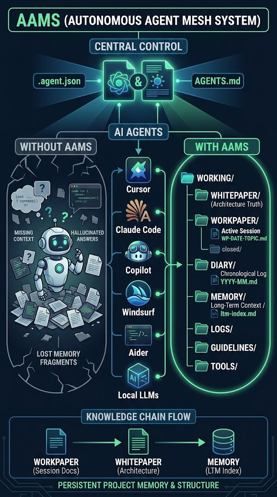

Ja, absolut! Die jetzige Webseite hat bereits eine gute inhaltliche Struktur, aber sie kann visuell und funktional noch **deutlich professioneller, lebendiger und zugänglicher** gestaltet werden.

Hier ist eine Analyse, was aktuell verbessert werden kann, und ein konkreter Gestaltungsentwurf für ein Upgrade.

---

### Was an der aktuellen Website verbessert werden kann:

1. **Visuelle Klarheit & Modernes Design:**
* Ein dunkles, modernes "Tech / Developer" Theme (Cyberpunk / Terminal-Nuancen mit klaren Akzenten wie Cyan/Green/Neon-Purple).
* Bessere Typografie und klare visueller Hierarchie (Hero-Bereich mit direktem Fokus auf Nutzen + Live-Code-Vorschau).


2. **Direkte Interaktivität (Copy-Buttons):**
* Ein klickbarer "Copy-to-Clipboard"-Button für den `curl`-Befehl und den Prompt, damit User nicht manuell markieren müssen.


3. **Visueller Vergleich / Vorher-Nachher:**
* Ein Gegenüberstellungs-Modul: *„Ohne AAMS vs. Mit AAMS“*, um auf den ersten Blick das Problem und die Lösung zu verdeutlichen.


4. **Interaktiver Baum / Datei-Explorer:**
* Eine animierte/interaktive Vorschau, wie die `WORKING/`-Struktur im Editor aussieht.


---

### Der fertige HTML/CSS Code (Single-Page Dashboard/Landingpage)

Hier ist ein kompletter, moderner Code (als `index.html`), den du direkt in dein `gh-pages` oder Repository einfügen kannst:

```html


  
  
  AAMS — Agent Manifest
  
  
  
  
  
  

  


  

```

[AAMS 1.0](#)

[Vorteile](#vorteile)
[Struktur](#struktur)
[GitHub Repository →](https://github.com/ogerly/AAMS)

Keine Software • Keine Dependencies • Eine Datei

# Die unsichtbare Ordnung für deine KI-Projekte

AAMS gibt jedem KI-Agenten (Copilot, Cursor, Claude Code) augenblicklich Gedächtnis, Struktur und klare Spielregeln — verankert in deinem Repository.

`curl -sO https://raw.githubusercontent.com/ogerly/AAMS/main/.agent.json`
Kopieren

## Warum AAMS dein Workflow verändert

### ❌ Ohne AAMS

Projekte verflogen bei jedem Session-Wechsel. Die KI halluziniert alte Entscheidungen, stellt dieselben Fragen erneut und verliert den Überblick in großen Repositories.

### ✅ Mit AAMS

Dein Projekt behält ein permanentes Gedächtnis. Jede Session hinterlässt klare Protokolle. Egal mit welchem KI-Tool du morgen arbeitest – das Wissen bleibt im Repo.

## Einheitliche Struktur im Ordner `WORKING/`

AAMS erstellt automatisch diesen sauberen Arbeitsbereich für deine Agents:

WORKING/


├── 📁 WORKPAPER/   ← Arbeitsprotokoll jeder einzelnen Session


├── 📁 WHITEPAPER/   ← Stabile System- und Architektur-Regeln


├── 📁 DIARY/       ← Chronologisches Entscheidungsbuch


└── 📁 MEMORY/      ← Langzeitgedächtnis (ltm-index.md)

AAMS — Agent Manifest • Open Source (CC0 / MIT)

```

```

---

### Was du jetzt tun kannst:

1. **Vorschau testen:** Du kannst diesen Code direkt kopieren und lokal als `index.html` im Browser öffnen, um den Unterschied zu sehen.
2. **Auf GitHub Pages veröffentlichen:** Ersetze einfach die `index.html` in deinem `AAMS`-Repo (Branch `main` oder `gh-pages`).


>>>>>>>>>>>>>>>>>>>>>>>>>>> webseitencode example


example landing page :  WORKING\WORKPAPER\aams_landing_page.html
abgestimmt mit der neuen README
bilder für die webseite : 
diese erklären AAMS besser. 


>>>>>>>>>>>>>>>
ist das jetzt alles konsistent ? eine einheitliche liene ?

Ja, das ist absolut konsistent und zieht eine durchgängige, einheitliche Linie – sowohl konzeptionell als auch in der technischen Umsetzung.

In den vorliegenden Dateien greift jedes Element lückenlos ineinander.

Warum das System jetzt 100% konsistent ist:
1. Einheitliche Terminology & Struktur (Cross-File Sync)
Die Ordnerarchitektur ist überall exakt identisch:

Root: .agent.json (Haupt-Manifest) und AGENTS.md (Bridge-Datei).

Arbeitsbereich: ./WORKING/ mit den Sub-Ordnern WORKPAPER/, WHITEPAPER/, DIARY/, MEMORY/, TOOLS/, LOGS/ & GUIDELINES/.

Sowohl auf der Landingpage (aams_landing_page.html) als auch in der README.md wird exakt dieselbe Namenskonvention (z.B. WP-{DATE}-{TOPIC}-{SUBTOPIC}-{description}.md) und Logik kommuniziert.  
HTML
+ 2

2. Einheitliches Wording & Messaging
Slogan & Pitch: sowol in der HTML (Die unsichtbare Ordnung für deine KI-Projekte) als auch in der README (Die unsichtbare Ordnung für deine KI-Projekte.) wird dieselbe, leicht verständliche Botschaft verwendet.  
HTML
+ 1

Kernversprechen: „Keine Software. Keine Installation. Eine einzige Datei.“ zieht sich als roter Faden durch alle Dokumente.  
HTML
+ 1

Philosophie: Die Aussage, dass AAMS als Spezifikation/Manifest agiert („befiehlt nichts, hat aber Enorm-Wirkung“), wird in den FAQ und Textabschnitten spiegelbildlich aufgegriffen.  
MD
+ 1

3. Perfekte UX & Bootstrap-Workflow (2-Schritte-Standard)
Sowohl im Quick-Start-Grid der Landingpage als auch in der README.md gibt es exakt die zwei gleichen Einstiegsschritte:  
HTML
+ 1

Command: curl -sO [https://raw.githubusercontent.com/ogerly/AAMS/main/.agent.json](https://raw.githubusercontent.com/ogerly/AAMS/main/.agent.json)

  
HTML
+ 1

Prompt: Lies .agent.json und führe agent_contract.on_first_entry aus. Starte sofort.

  
HTML
+ 1

4. Repo- & Versionen-Konsistenz
Die Repository-Links zeigen einheitlich auf [github.com/ogerly/AAMS](https://github.com/ogerly/AAMS).  
HTML
+ 1

Die Landingpage (AAMS/2.4.0) deckt alle geforderten KI-Tools ab (Cursor, Claude Code, Copilot, Windsurf, Aider, LM Studio / Ollama).  
HTML
+ 1

Fazit
Die Landingpage (aams_landing_page.html) übersetzt die Markenidentität und die technische Spezifikation aus der README.md visuell und interaktiv. Die Linie ist klar, auf den Punkt gebracht und wirkt wie aus einem Guss.  
HTML
+ 1